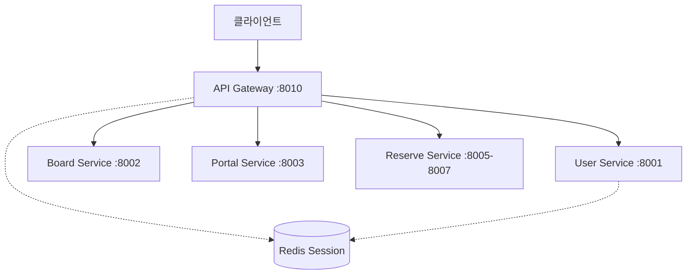
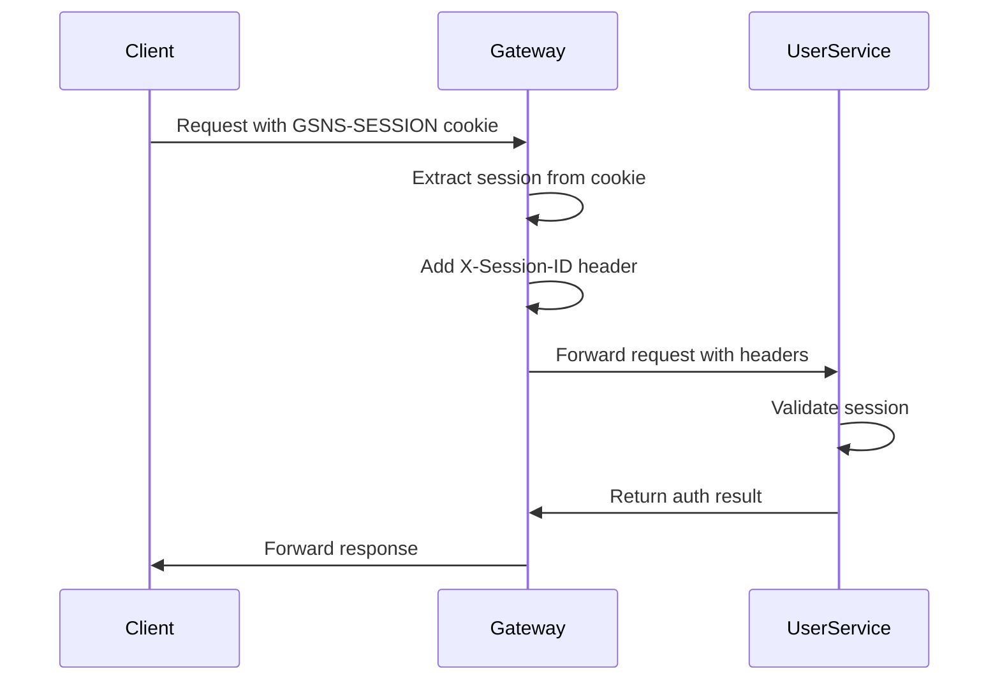
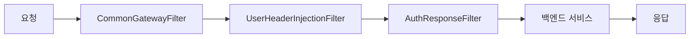

# 🌐 API Gateway

**eGovFrame Cloud 마이크로서비스 아키텍처**의 중앙 게이트웨이 서비스입니다. 모든 클라이언트 요청의 단일 진입점 역할을 합니다.

## 📋 목차
- [개요](#개요)
- [주요 기능](#주요-기능)
- [기술 스택](#기술-스택)
- [프로젝트 구조](#프로젝트-구조)
- [설치 및 실행](#설치-및-실행)
- [라우팅 설정](#라우팅-설정)
- [보안 및 인증](#보안-및-인증)
- [필터 시스템](#필터-시스템)
- [모니터링](#모니터링)
- [개발 가이드](#개발-가이드)

---

## 🎯 개요

API Gateway는 Spring Cloud Gateway를 기반으로 한 마이크로서비스 아키텍처의 핵심 컴포넌트로, 라우팅, 보안, 모니터링, 로드 밸런싱 등의 기능을 제공합니다.

### 🏗️ 아키텍처 특징
- **단일 진입점**: 모든 클라이언트 요청의 중앙 집중화
- **비동기 처리**: Spring WebFlux 기반 리액티브 아키텍처
- **동적 라우팅**: 설정 기반 유연한 서비스 라우팅
- **통합 보안**: 세션 기반 인증 및 권한 검증

### 🎭 주요 역할


---

## ⚡ 주요 기능

### 🛣️ 라우팅 및 로드밸런싱
- **동적 라우팅**: 요청 경로 기반 서비스 라우팅
- **경로 재작성**: 클라이언트와 백엔드 서비스 간 URL 변환
- **로드밸런싱**: 백엔드 서비스 인스턴스 간 부하 분산

### 🔐 보안 및 인증
- **세션 기반 인증**: 쿠키에서 세션 ID 추출 및 헤더 변환
- **권한 검증**: User Service 연동 실시간 권한 체크
- **CORS 처리**: 크로스 오리진 요청 정책 관리

### 📊 모니터링 및 로깅
- **요청/응답 로깅**: 모든 트래픽에 대한 상세 로그
- **성능 메트릭**: 응답 시간, 처리량 등 성능 지표
- **에러 처리**: 통합 예외 처리 및 사용자 친화적 에러 메시지

### 🔧 트래픽 관리
- **요청 필터링**: 악성 요청 차단
- **헤더 조작**: 서비스 간 통신을 위한 헤더 추가/제거
- **응답 변환**: 백엔드 응답의 클라이언트 맞춤 변환

---

## 🛠️ 기술 스택

| 분류 | 기술 | 버전 | 용도 |
|------|------|------|------|
| **Framework** | Spring Boot | 2.7.18 | 메인 프레임워크 |
| **Gateway** | Spring Cloud Gateway | 2021.0.9 | API 게이트웨이 |
| **Reactive** | Spring WebFlux | 5.3.x | 비동기 웹 처리 |
| **Security** | Spring Security | 5.7.x | 보안 설정 |
| **Networking** | Netty | 4.1.x | 비동기 네트워크 처리 |
| **Monitoring** | Spring Actuator | - | 헬스 체크 및 메트릭 |
| **Documentation** | SpringDoc OpenAPI | 1.7.0 | API 문서화 |

---

## 📁 프로젝트 구조

```
src/main/java/org/egovframe/cloud/apigateway/
├── ApigatewayApplication.java        # 메인 애플리케이션
├── api/
│   └── TestPageController.java       # 테스트 페이지 컨트롤러
├── config/
│   ├── WebFluxConfig.java           # WebFlux 설정
│   ├── WebFluxSecurityConfig.java   # 보안 설정
│   ├── ReactiveAuthorization.java   # 리액티브 권한 체크
│   ├── MessageSourceConfig.java     # 다국어 메시지 설정
│   └── GlobalConstant.java          # 전역 상수
├── domain/
│   └── User.java                    # 사용자 도메인 모델
├── dto/
│   ├── AuthCheckResponse.java       # 권한 체크 응답 DTO
│   └── AuthResult.java              # 인증 결과 DTO
├── exception/
│   ├── GatewayErrorWebExceptionHandler.java  # 전역 예외 처리
│   ├── BusinessException.java       # 비즈니스 예외
│   └── BusinessMessageException.java # 메시지 예외
└── filter/
    ├── CommonGatewayFilter.java     # 공통 게이트웨이 필터
    ├── UserHeaderInjectionFilter.java # 사용자 헤더 주입 필터
    └── AuthResponseFilter.java      # 인증 응답 필터

resources/
├── application.yml                   # 메인 설정
├── bootstrap.yml                    # 부트스트랩 설정
├── messages.properties              # 기본 메시지
├── messages_en.properties           # 영문 메시지
└── logback-spring.xml               # 로깅 설정
```

---

## 🚀 설치 및 실행

### 📋 사전 요구사항
- **Java**: 11+ (권장)
- **Gradle**: 7.4+
- **User Service**: 실행 중이어야 함 (권한 검증용)

### ⚙️ 환경 설정

1. **백엔드 서비스 실행**
   ```bash
   # User Service 실행 (8001 포트)
   ./gradlew :user-service:bootRun
   
   # Board Service 실행 (8002 포트) - 선택사항
   ./gradlew :board-service:bootRun
   ```

2. **환경변수 설정** (선택사항)
   ```bash
   export SPRING_PROFILES_ACTIVE=local
   export USER_SERVICE_URL=http://localhost:8001
   export BOARD_SERVICE_URL=http://localhost:8002
   ```

### 🏃‍♂️ 실행 방법

#### Gradle로 실행
```bash
# 프로젝트 루트에서
./gradlew :apigateway:bootRun

# 또는 apigateway 디렉토리에서
cd apigateway
./gradlew bootRun
```

#### JAR 파일로 실행
```bash
# 빌드
./gradlew :apigateway:build

# 실행
java -jar apigateway/build/libs/apigateway-1.0.0.jar
```

#### IDE에서 실행
`ApigatewayApplication.java`의 main 메서드 실행

### ✅ 실행 확인
```bash
# 헬스 체크
curl http://localhost:8010/actuator/health

# 게이트웨이를 통한 User Service 호출
curl http://localhost:8010/user-service/actuator/health
```

---

## 🛣️ 라우팅 설정

### 📍 서비스 라우팅 맵

| 서비스 | 포트 | 라우팅 경로 | 백엔드 URL |
|--------|------|-------------|------------|
| **User Service** | 8001 | `/user-service/**` | `http://localhost:8001` |
| **Board Service** | 8002 | `/board-service/**` | `http://localhost:8002` |
| **Portal Service** | 8003 | `/portal-service/**` | `http://localhost:8003` |
| **Reserve Item** | 8005 | `/reserve-item-service/**` | `http://localhost:8005` |
| **Reserve Check** | 8006 | `/reserve-check-service/**` | `http://localhost:8006` |
| **Reserve Request** | 8007 | `/reserve-request-service/**` | `http://localhost:8007` |

### ⚙️ 라우팅 설정 상세

```yaml
spring:
  cloud:
    gateway:
      routes:
        # User Service 라우팅
        - id: user-service
          uri: ${user-service.url}
          predicates:
            - Path=/user-service/**
          filters:
            - RemoveRequestHeader=Cookie    # 보안을 위한 쿠키 제거
            - RewritePath=/user-service/(?<segment>.*), /$\{segment}
        
        # Board Service 라우팅  
        - id: board-service
          uri: ${board-service.url}
          predicates:
            - Path=/board-service/**
          filters:
            - RewritePath=/board-service/(?<segment>.*), /$\{segment}
        
        # 기본 필터 적용
      default-filters:
        - name: CommonGatewayFilter
          args:
            preLogger: true    # 요청 로깅
            postLogger: true   # 응답 로깅
```

### 🔄 동적 라우팅 예시

```java
@Component
public class DynamicRouteConfig {
    
    @EventListener
    public void handleServiceRegistration(ServiceRegisteredEvent event) {
        // 새로운 서비스가 등록되면 동적으로 라우팅 추가
        addRoute(event.getServiceId(), event.getServiceUrl());
    }
}
```

---

## 🔐 보안 및 인증

### 🍪 세션 기반 인증 플로우



### 🔒 보안 헤더 변환

#### 입력 (클라이언트 → 게이트웨이)
```http
Cookie: GSNS-SESSION=abc123-def456-ghi789; other=value
```

#### 출력 (게이트웨이 → 백엔드)
```http
X-Session-ID: abc123-def456-ghi789
X-Service-Name: user-service
```

### 🛡️ 보안 정책

```java
@Configuration
@EnableWebFluxSecurity
public class WebFluxSecurityConfig {
    
    @Bean
    public SecurityWebFilterChain springSecurityFilterChain(ServerHttpSecurity http) {
        return http
            .csrf(csrf -> csrf.disable())
            .authorizeExchange(exchanges -> exchanges
                .pathMatchers("/actuator/**").permitAll()
                .pathMatchers("/auth-service/**").permitAll()
                .anyExchange().authenticated()
            )
            .build();
    }
}
```

---

## 🔧 필터 시스템

### 🎯 필터 실행 순서



### 🚀 CommonGatewayFilter

**주요 기능:**
- 요청/응답 로깅
- 세션 쿠키 → 헤더 변환
- 서비스명 추출 및 헤더 추가

```java
@Component
public class CommonGatewayFilter extends AbstractGatewayFilterFactory<Config> {
    
    @Override
    public GatewayFilter apply(Config config) {
        return (exchange, chain) -> {
            ServerHttpRequest request = exchange.getRequest();
            
            // 세션 쿠키 추출
            HttpCookie sessionCookie = request.getCookies().getFirst("GSNS-SESSION");
            
            // 헤더 변환
            if (sessionCookie != null) {
                request = request.mutate()
                    .header("X-Session-ID", sessionCookie.getValue())
                    .build();
            }
            
            return chain.filter(exchange.mutate().request(request).build());
        };
    }
}
```

### 👤 UserHeaderInjectionFilter

**주요 기능:**
- 인증된 사용자 정보 헤더 추가
- 권한 정보 주입
- 사용자 컨텍스트 전파

```java
@Component
public class UserHeaderInjectionFilter implements GlobalFilter {
    
    @Override
    public Mono<Void> filter(ServerWebExchange exchange, GatewayFilterChain chain) {
        return authenticateUser(exchange)
            .flatMap(user -> {
                ServerHttpRequest request = exchange.getRequest().mutate()
                    .header("X-User-ID", user.getUserId())
                    .header("X-User-Role", user.getRole())
                    .build();
                
                return chain.filter(exchange.mutate().request(request).build());
            });
    }
}
```

### 🔍 AuthResponseFilter

**주요 기능:**
- 응답 상태 코드 기반 처리
- 인증 실패 시 리다이렉션
- 에러 응답 변환

---

## 📊 모니터링

### 🔍 로깅 설정

```yaml
logging:
  level:
    org.egovframe.cloud.apigateway: INFO
    org.springframework.cloud.gateway: WARN
    io.netty: WARN
    reactor.netty: WARN
```

### 📈 주요 로그 포인트

#### 요청 로그
```
[GlobalFilter Start] request ID: 12345, method: GET, path: /user-service/api/users/profile
```

#### 응답 로그
```
[GlobalFilter End] request ID: 12345, method: GET, path: /user-service/api/users/profile, statusCode: 200 OK
```

#### 세션 처리 로그
```
Found session cookie: abc123***
Adding X-Session-ID header: abc123***
```

### 📊 Actuator 엔드포인트

```http
GET /actuator/health           # 서비스 상태
GET /actuator/info            # 애플리케이션 정보
GET /actuator/gateway/routes  # 현재 라우팅 설정
GET /actuator/metrics         # 성능 메트릭
```

#### 라우팅 정보 조회
```bash
curl http://localhost:8010/actuator/gateway/routes | jq '.'
```

**응답 예시:**
```json
[
  {
    "route_id": "user-service",
    "route_definition": {
      "id": "user-service",
      "predicates": [{"name": "Path", "args": {"pattern": "/user-service/**"}}],
      "filters": [{"name": "RewritePath", "args": {"regexp": "/user-service/(?<segment>.*)", "replacement": "/${segment}"}}],
      "uri": "http://localhost:8001"
    }
  }
]
```

### 🚨 알람 및 메트릭

#### 응답 시간 모니터링
```bash
# 특정 경로 응답 시간 측정
time curl http://localhost:8010/user-service/actuator/health
```

#### 에러율 모니터링
```bash
# 5xx 에러 비율 확인
curl -s http://localhost:8010/actuator/metrics/http.server.requests | \
  jq '.measurements[] | select(.statistic=="COUNT") | .value'
```

---

## 🔧 개발 가이드

### 🆕 새로운 서비스 추가

1. **application.yml에 서비스 URL 추가**
   ```yaml
   new-service:
     url: http://localhost:8008
   ```

2. **라우팅 규칙 추가**
   ```yaml
   spring:
     cloud:
       gateway:
         routes:
           - id: new-service
             uri: ${new-service.url}
             predicates:
               - Path=/new-service/**
             filters:
               - RewritePath=/new-service/(?<segment>.*), /$\{segment}
   ```

3. **필터에 서비스명 추가** (필요시)
   ```java
   private boolean isKnownService(String serviceName) {
       Set<String> knownServices = Set.of(
           "user-service", "board-service", "new-service"
       );
       return knownServices.contains(serviceName);
   }
   ```

### 🔧 커스텀 필터 개발

```java
@Component
public class CustomFilter implements GlobalFilter, Ordered {
    
    @Override
    public Mono<Void> filter(ServerWebExchange exchange, GatewayFilterChain chain) {
        // Pre-filter 로직
        ServerHttpRequest request = exchange.getRequest();
        
        return chain.filter(exchange)
            .then(Mono.fromRunnable(() -> {
                // Post-filter 로직
                ServerHttpResponse response = exchange.getResponse();
            }));
    }
    
    @Override
    public int getOrder() {
        return -1; // 필터 실행 순서
    }
}
```

### 🧪 테스트

#### 단위 테스트
```bash
./gradlew :apigateway:test
```

#### 통합 테스트
```java
@SpringBootTest(webEnvironment = SpringBootTest.WebEnvironment.RANDOM_PORT)
@TestPropertySource(properties = {
    "user-service.url=http://localhost:${wiremock.server.port}"
})
class ApigatewayIntegrationTest {
    
    @Test
    void shouldRouteToUserService() {
        webTestClient.get()
            .uri("/user-service/actuator/health")
            .exchange()
            .expectStatus().isOk();
    }
}
```

### 🐳 Docker 배포

#### Dockerfile
```dockerfile
FROM openjdk:11-jre-slim

# 애플리케이션 JAR 복사
COPY build/libs/apigateway-1.0.0.jar app.jar

# 포트 노출
EXPOSE 8010

# 환경변수 설정
ENV SPRING_PROFILES_ACTIVE=docker

# 애플리케이션 실행
ENTRYPOINT ["java", "-jar", "/app.jar"]
```

#### docker-compose.yml
```yaml
version: '3.8'
services:
  apigateway:
    build: .
    ports:
      - "8010:8010"
    environment:
      - USER_SERVICE_URL=http://user-service:8001
      - BOARD_SERVICE_URL=http://board-service:8002
    depends_on:
      - user-service
      - board-service
    networks:
      - microservices

  user-service:
    image: user-service:latest
    ports:
      - "8001:8001"
    networks:
      - microservices

networks:
  microservices:
    driver: bridge
```

### ⚡ 성능 최적화

#### Netty 설정
```yaml
spring:
  cloud:
    gateway:
      httpclient:
        connect-timeout: 1000      # 연결 타임아웃
        response-timeout: 5s       # 응답 타임아웃
        pool:
          max-connections: 500     # 최대 연결 수
          max-idle-time: 30s       # 유휴 연결 시간
```

#### 메모리 설정
```bash
# JVM 옵션
java -Xms512m -Xmx1024m -jar apigateway.jar
```

---

## 🌐 클라이언트 연동 가이드

### 📱 웹 클라이언트 연동

#### JavaScript/TypeScript
```javascript
// API 호출 예시
const API_BASE_URL = 'http://localhost:8010';

async function fetchUserProfile() {
    const response = await fetch(`${API_BASE_URL}/user-service/api/users/profile`, {
        credentials: 'include',  // 쿠키 포함
        headers: {
            'Content-Type': 'application/json'
        }
    });
    
    if (!response.ok) {
        throw new Error(`HTTP error! status: ${response.status}`);
    }
    
    return await response.json();
}
```

#### React 예시
```jsx
import { useEffect, useState } from 'react';

const UserProfile = () => {
    const [profile, setProfile] = useState(null);
    
    useEffect(() => {
        fetch('/user-service/api/users/profile', {
            credentials: 'include'
        })
        .then(res => res.json())
        .then(data => setProfile(data.profile));
    }, []);
    
    return (
        <div>
            {profile && (
                <div>
                    <h2>{profile.username}</h2>
                    <p>{profile.email}</p>
                </div>
            )}
        </div>
    );
};
```

### 📱 모바일 앱 연동

#### HTTP 헤더 설정
```http
POST /user-service/api/auth/login
Content-Type: application/json
X-App-Version: 1.0.0
X-Device-ID: device_unique_id

{
    "username": "user@example.com",
    "password": "password"
}
```

### 🔗 API 호출 패턴

#### 인증이 필요한 API
```bash
# 1. 로그인하여 세션 획득
curl -X POST http://localhost:8010/user-service/api/auth/login \
  -H "Content-Type: application/json" \
  -d '{"username":"admin","password":"admin"}' \
  -c cookies.txt

# 2. 세션 쿠키를 사용하여 API 호출
curl http://localhost:8010/user-service/api/users/profile \
  -b cookies.txt
```

---

## ❓ 트러블슈팅

### 🚨 일반적인 문제와 해결방법

#### 1. 502 Bad Gateway 에러
```bash
# 백엔드 서비스 상태 확인
curl http://localhost:8001/actuator/health

# 게이트웨이 라우팅 설정 확인
curl http://localhost:8010/actuator/gateway/routes
```

#### 2. 세션 인증 실패
```bash
# 세션 쿠키 확인
curl -v http://localhost:8010/user-service/api/users/profile

# User Service 직접 호출 테스트
curl http://localhost:8001/api/auth/validate \
  -H "X-Session-ID: your-session-id"
```

#### 3. CORS 에러
```yaml
# application.yml에 CORS 설정 추가
spring:
  cloud:
    gateway:
      globalcors:
        cors-configurations:
          '[/**]':
            allowedOrigins: "*"
            allowedMethods:
              - GET
              - POST
              - PUT
              - DELETE
            allowedHeaders: "*"
```

#### 4. 메모리 부족
```bash
# JVM 힙 메모리 증가
export JAVA_OPTS="-Xms1g -Xmx2g"
./gradlew bootRun
```

### 📊 성능 문제 진단

#### 응답 시간 분석
```bash
# 각 구간별 응답 시간 측정
curl -w "@curl-format.txt" http://localhost:8010/user-service/api/users/profile

# curl-format.txt 내용:
#     time_namelookup:  %{time_namelookup}\n
#        time_connect:  %{time_connect}\n
#     time_appconnect:  %{time_appconnect}\n
#    time_pretransfer:  %{time_pretransfer}\n
#       time_redirect:  %{time_redirect}\n
#  time_starttransfer:  %{time_starttransfer}\n
#                     ----------\n
#          time_total:  %{time_total}\n
```

---

## 🔗 관련 링크

- **User Service**: [../user-service/README.md](../user-service/README.md)
- **Board Service**: [../board-service/README.md](../board-service/README.md)
- **Module Common**: [../module-common/README.md](../module-common/README.md)
- **Spring Cloud Gateway**: [https://spring.io/projects/spring-cloud-gateway](https://spring.io/projects/spring-cloud-gateway)
- **eGovFrame**: [https://www.egovframe.go.kr/](https://www.egovframe.go.kr/)

---

## 📞 문의 및 지원

- **이슈 신고**: GitHub Issues
- **기술 지원**: 개발팀 연락처
- **문서 개선**: Pull Request 환영
- **아키텍처 논의**: 팀 슬랙 채널

---

*마지막 업데이트: 2025년 7월 14일*